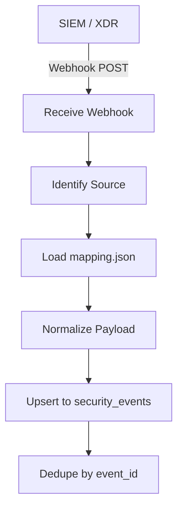
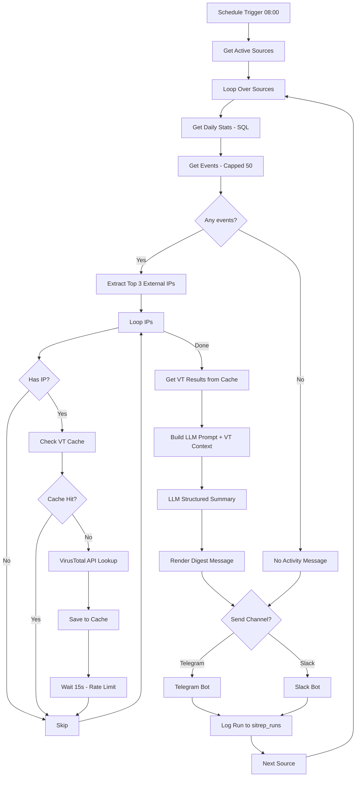
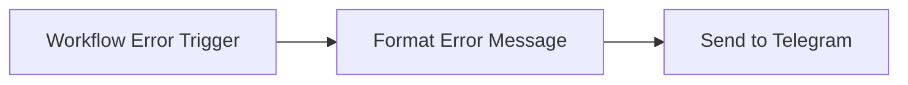

# SigOne

Any SIEM, one daily brief. A source-agnostic security alert digest pipeline built on n8n, Postgres, and structured LLM output.

License: MIT · Platform: n8n · Status: MVP v0.1

## If you are... Start here

| If you are... | Start here |
| --- | --- |
| Onboarding your SIEM for the first time | [`sources/<your-siem>/source-card.md`](./sources/) |
| Writing a mapping for an unsupported SIEM | [`docs/mapping-config-spec.md`](./docs/mapping-config-spec.md) |
| A SOC manager wanting the digest format | [`examples/sample-digest.md`](./examples/sample-digest.md) |
| An MSSP with multiple clients' SIEMs | [`methodology/01-source-onboarding.md`](./methodology/01-source-onboarding.md) |
| Checking what MITRE mapping policy is | [`methodology/04-mitre-passthrough-policy.md`](./methodology/04-mitre-passthrough-policy.md) |
| A recruiter / hiring manager | README + one [Source Card](./sources/) + [sample digest](./examples/sample-digest.md) |

## What this is

SigOne ingests security alerts from any SIEM or XDR, normalizes them into one common schema via a per-source mapping config, and delivers a structured daily brief to WhatsApp, Slack, or Telegram. It never invents MITRE ATT&CK mappings — it passes through what the source already provides, or leaves the field null. Adding a new SIEM means writing a mapping config, not new workflow logic.

## Quick start

1. Execute [`db/schema.sql`](./db/schema.sql) in your PostgreSQL instance.
2. Import the workflows from the [`workflows/`](./workflows/) directory into your n8n instance.
3. Configure the `source_registry` table with your SIEMs (e.g., Wazuh). Use the provided `mapping.json` files in [`sources/`](./sources/).
4. Point your SIEM webhooks at the `sigone-ingest` webhook endpoint (ensure authentication headers are set).

## Supported sources

- **Wazuh** (v0.1) — MITRE tagging: *Null unless manually tagged*
- **Splunk HEC** (v0.2) — MITRE tagging: *Null unless manually tagged via ES/CIM*
- **Generic JSON** (v0.2) — MITRE tagging: *User-defined fallback*
- **Microsoft Sentinel** (v0.3) — MITRE tagging: *Native extraction*
- **CrowdStrike Falcon** (v0.3) — MITRE tagging: *Native extraction*
- **Elastic Security** (v1.0) — MITRE tagging: *Conditional native extraction*

## How it works

### Ingestion (Real-time)

Your SIEM sends alerts to a generic webhook. SigOne identifies the source, loads its mapping config, normalizes the payload, and upserts it into Postgres with deduplication.

### Daily Digest (Scheduled batch)

A scheduled workflow loops over all active sources, computes deterministic stats via SQL, enriches top IPs via VirusTotal (with local caching), then sends an LLM-structured summary to Telegram or Slack.

### Error Alerting

If any workflow fails, `sigone-error-alert` catches the error and sends a diagnostic message (workflow name, failing node, error detail) to Telegram.

## Adding a new source

Adding a new source does not require writing new n8n workflow logic. Simply write a new JSON mapping config. See [`docs/mapping-config-spec.md`](./docs/mapping-config-spec.md) for syntax, null-fallback logic, and required array flattening behaviors.

You can then add your source via the included [`sigone-admin.json`](./workflows/sigone-admin.json) webhook form without ever touching the SQL database manually.

## Example output

See [`examples/sample-digest.md`](./examples/sample-digest.md) for a representative daily brief.

## Repository structure

- [`methodology/`](./methodology/): Principles behind normalization and severity/MITRE mappings.
- [`sources/`](./sources/): Source Cards and mapping configurations for specific SIEMs/XDRs.
- [`docs/`](./docs/): Specs and schema references.
- [`db/`](./db/): Database schemas.
- [`workflows/`](./workflows/): Exported n8n workflow definitions.
- [`examples/`](./examples/): Sample outputs and raw data fixtures.
- [`tests/`](./tests/): Mapping configuration test scripts.

## MITRE ATT&CK policy

We **never** guess. We either extract it from the source payload, or we leave it null. See [`methodology/04-mitre-passthrough-policy.md`](./methodology/04-mitre-passthrough-policy.md) for details.

## Roadmap

- **v0.1:** Core pipeline, Postgres schema, Telegram support, Wazuh preset.
- **v0.2:** Source-agnostic proof (Splunk HEC, Generic JSON), UI admin form.
- **v0.3:** MSSP support (multi-tenant), Sentinel, CrowdStrike, Slack support.
- **v1.0:** Stable release, Elastic support, Finalized documentation.
- **v1.1:** Threat Intel Enrichment — VirusTotal integration with smart caching, rate-limit-safe top-3-IP lookup, emoji-coded risk indicators in digest messages.

## Security and privacy

All API keys, DB credentials, and bot tokens are stored solely in n8n credentials. The database `raw` column retains original event payloads for audit, but the LLM receives only a limited, field-extracted summary payload.

## Author

**Eky Januarta** — [1tsprune.com](https://1tsprune.com)

## License

MIT License.
